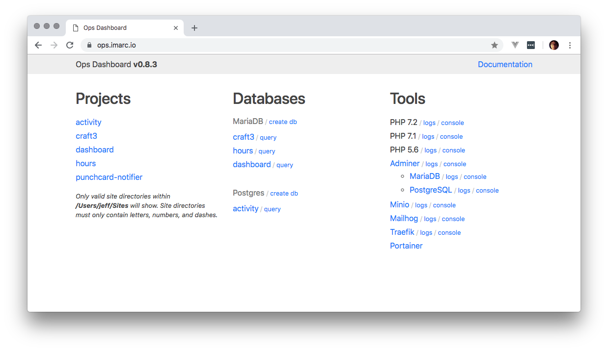

# Ops

- A local development environment focused on PHP-based projects.
- Create a new host by making a directory.
- Local HTTPS with self-signed certs.
- Shared services: MariaDB, PostgreSQL, Redis, Mailhog, Adminer, and more.
- Sync remote databases and filesystem paths to local projects.
- Built on Docker and Traefik. Configure project-specific services when required.

## Prerequisites

Ops supports Linux, Mac, and *almost supports* Windows Subshell Linux (WSL)

`bash`, `npm`, `docker`, `docker-compose`, `ssh`, and `rsync` are required.

On linux `certutil` is required.

### Linux Installation Instructions

- [Install Docker CE](https://docs.docker.com/engine/installation/linux/)

Install `certutil`

    # Ubuntu/Debian
    sudo apt install libnss3-tools

    # CentOS/Redhat
    sudo yum install nss-tools

    # Arch
    sudo pacman -S nss

### Mac Installation Instructions

- [Install Docker Desktop](https://docs.docker.com/docker-for-mac/install/)

If you use Firefox, you should install `nss` with homebrew.

    brew install nss

### Windows Subshell for Linux

- [Install Docker Desktop](https://docs.docker.com/docker-for-windows/install/)
- [Install Docker Client](https://medium.com/@sebagomez/installing-the-docker-client-on-ubuntus-windows-subsystem-for-linux-612b392a44c4)

## How To Install

Install/Update ops:

    npm install -g git+ssh://git@gitlab.imarc.net:imarc/ops.git

 **On first install, You will be asked for your sudo/system password in order to install the self-signed certs for HTTPS support**

## Create Your First Project

To start ops services, run `ops start`

To add a new project, create a directory within $HOME/Sites. Your local project will then be available at `https://{directory}.imarc.io`.

The project directory name can only contain letters, numbers, and dashes ([A-Za-z0-9-]+).

By default the document root is set to a `public` directory within your project.

To stop ops, run `ops stop`

## The Dashboard

The dashboard ([https://ops.imarc.io](https://ops.imarc.io)) will show you all projects and let you manage services.

## Project Configuration

Within your project's .env file you can set the following options:

    # set the application backend
    # values: apache-php56, apache-php71, apache-php72
    # default: apache-php71
    OPS_PROJECT_BACKEND="apache-php71"

    # set the project document root
    # default: public
    #OPS_PROJECT_DOCROOT="public"

## Connect to Services

You can connect your app to the following shared services:

**MariaDB 10.3** 
hostname: mariadb 
username: root 
password: *none* 
port: 3306

**PostgreSQL 9.6** 
hostname: postgres 
username: postgres 
password: *none* 
port: 5432

**Redis 3.2** 
hostname: redis 
port: 6379

**Memcached 1.4** 
hostname: memcached 
port: 11211

**Minio** 
hostname: minio 
access key: minio-access 
secret key: minio-secret 

**Mailhog** 
*SMTP Config:* 
hostname: mailhog 
port: 1025

## External Dependencies

Out of the box, the main/shared PHP container relies on the imarcagency/php-apache image.

This is a separate project and can be viewed on [Github](https://github.com/imarc/docker-php-apache) or [Docker Hub](https://hub.docker.com/r/imarcagency/php-apache/)

## Remote to Local Syncing

With a few settings in a project's `.env` file, you can sync the project's database and filesystem storage
from a remote server. Ideally, these settings should be checked into version control within a `.env.example` file to be shared amongst the development team.

Currently `ops sync` assumes the following:

- SSH access is enabled to the remote web and/or DB servers
- DB servers make their tools available to the SSH user: mysqldump, pg_dump, etc.
- the DB user has passwordless access to databases from localhost

**Pro-tip:** If you are brave, there is an undocumented way to completely overload the sync command for a custom setup.

The following settings can be placed in the project's `.env`

    # the local database type: mariadb, postgres
    # default: none
    OPS_PROJECT_DB_TYPE=""

    # the local database name.
    # default: the project name (which is the directory name)
    OPS_PROJECT_DB_NAME="${OPS_PROJECT_NAME}"

    # space separated relative dirs to sync down
    # default: none
    OPS_PROJECT_SYNC_DIRS=""

    # disable remote database sync. 1 or 0
    # default: 0
    OPS_PROJECT_SYNC_NODB="0"

    # space separated rsync exclude patterns
    # default: none
    OPS_PROJECT_SYNC_EXCLUDES=""

    # rsync max filesize to sync
    # default: 500M
    OPS_PROJECT_SYNC_MAXSIZE="500M"

    # the remote hostname for the filesystem sync
    # default: the project name (which is the directory name)
    OPS_PROJECT_REMOTE_HOST="${OPS_PROJECT_NAME}"

    # the remote SSH user for the filesystem sync
    # default: none
    OPS_PROJECT_REMOTE_USER=""

    # the remote project path for the filesystem sync
    # default: none
    OPS_PROJECT_REMOTE_PATH=""

    # the remote hostname for the database sync
    # default: the remote hostname for the filesystem sync
    OPS_PROJECT_REMOTE_DB_HOST=""

    # the remote database type
    # default: the local database type
    OPS_PROJECT_REMOTE_DB_TYPE="${OPS_PROJECT_DB_TYPE-$OPS_PROJECT_DB_TYPE}"

    # the remote database name
    # default: the local database name
    OPS_PROJECT_REMOTE_DB_NAME="${$OPS_PROJECT_DB_NAME}"

    # the remote database user
    # default: the remote SSH user
    OPS_PROJECT_REMOTE_DB_USER="${OPS_PROJECT_REMOTE_USER}"

    # the remote database password
    #
    # !!! best practice is to not use this and instead place a .my.cnf file
    # !!! in your remote home directory. that is more secure as it won't
    # !!! leak your password in cli history or process lists
    #
    # default: none
    OPS_PROJECT_REMOTE_DB_PASSWORD=""

    # the remote database port
    # default: 3306 for mariadb, 5432 for psql
    OPS_PROJECT_REMOTE_DB_PORT=""

## Custom Project Container

*This is for advanced users and it would be best to have a solid understanding of docker and docker-compose files
before moving forward with implementing this solution*

There are times where you want to configura a custom container to run your project. This could be due to:

- Your project needs a special PHP configuration or extension.
- Your project need to lock down the PHP version or use a specific image.
- You are using a language that isn't PHP.

With a little configuration, Ops allows you to run a custom container beside the shared services. Ops' `project`
subcommands deal with project specific compose commands. Running `ops link` within a project directory
will load a `ops-compose.yml` file.

By linking a project, its containers will respond to with `ops start` and `ops stop` commands.

To unlink a project and remove its container run `ops unlink` within a project directory.

Here is a generic ops-compose.yml file:

    version: '2'

    services:
      craft:
        image: imarcagency/ops-apache-php72:${OPS_VERSION}

        labels:
          - "ops.project=${OPS_PROJECT_NAME}"
          - "ops.hostname=${OPS_PROJECT_NAME}.${OPS_DOMAIN}"
          - "traefik.enable=true"
          - "traefik.docker.network=ops_gateway"
          - "traefik.frontend.rule=Host:${OPS_PROJECT_NAME}.${OPS_DOMAIN}"
          - "traefik.port=80"
        environment:
          - "APACHE_UID=${OPS_DOCKER_UID}"
          - "APACHE_GID=${OPS_DOCKER_GID}"
          - "APACHE_ROOT=/var/www/public"
        volumes:
          - "./:/var/www/:cached"
        networks:
          - default
          - ops_gateway
          - ops_backend

    networks:
      ops_gateway:
        external: true
      ops_backend:
        external: true

The most important things are the labels and the networks.
Those settings are required for the proxy to function or for your app to conenct to shared services.
Everything else can be customized to whatever your app requires.

## Contributing

If you are contributing to ops, debugging, or want to try out bleeding edge features, It is recommended you install like so:

    # clone into a local dir and enter dir
    git clone git@gitlab.imarc.net:imarc/ops.git
    cd ops

    # create 'ops' symlink to your repo
    npm install -g .

This means your global ops script will point directly to the repo and you can make live changes.

## License

MIT License

Copyright (c) 2018 Imarc
